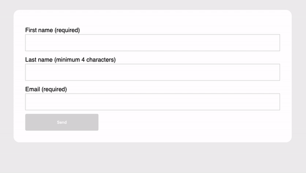

# JavaScript 1 - Module 4

## Lesson Task 4 Question

When the input values change, validate the values and enable the button if all values are valid.

Once the form is submitted display a message to the user that form was submitted.

